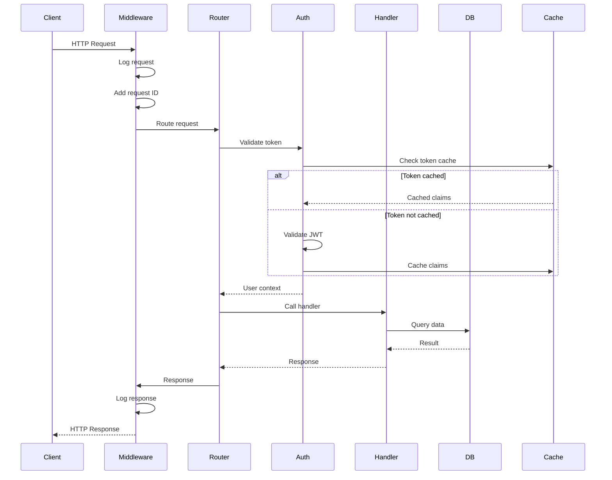
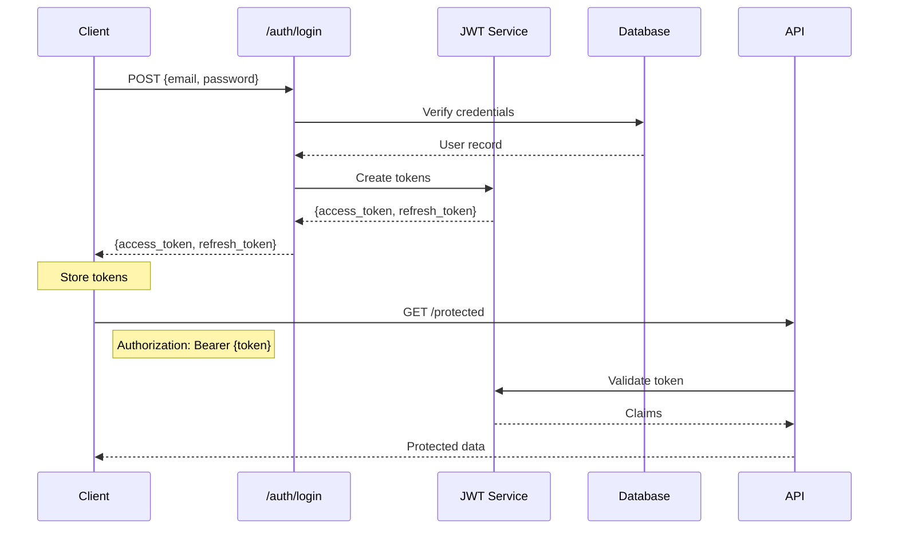
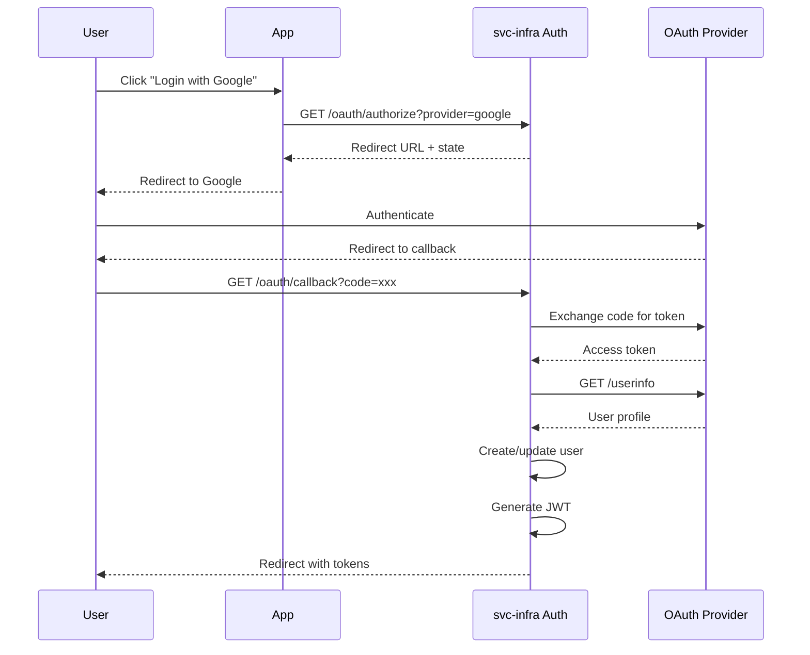
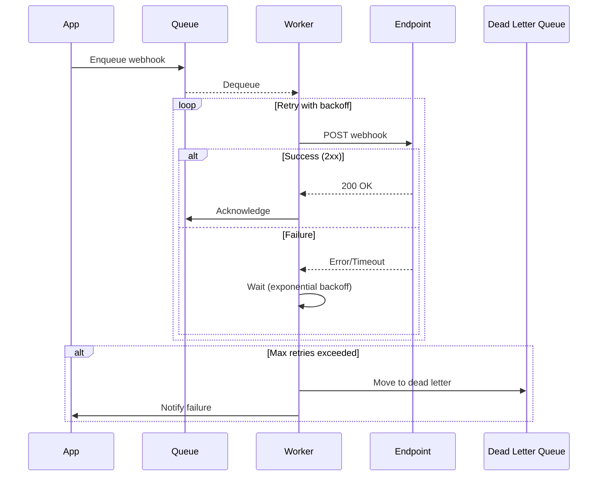
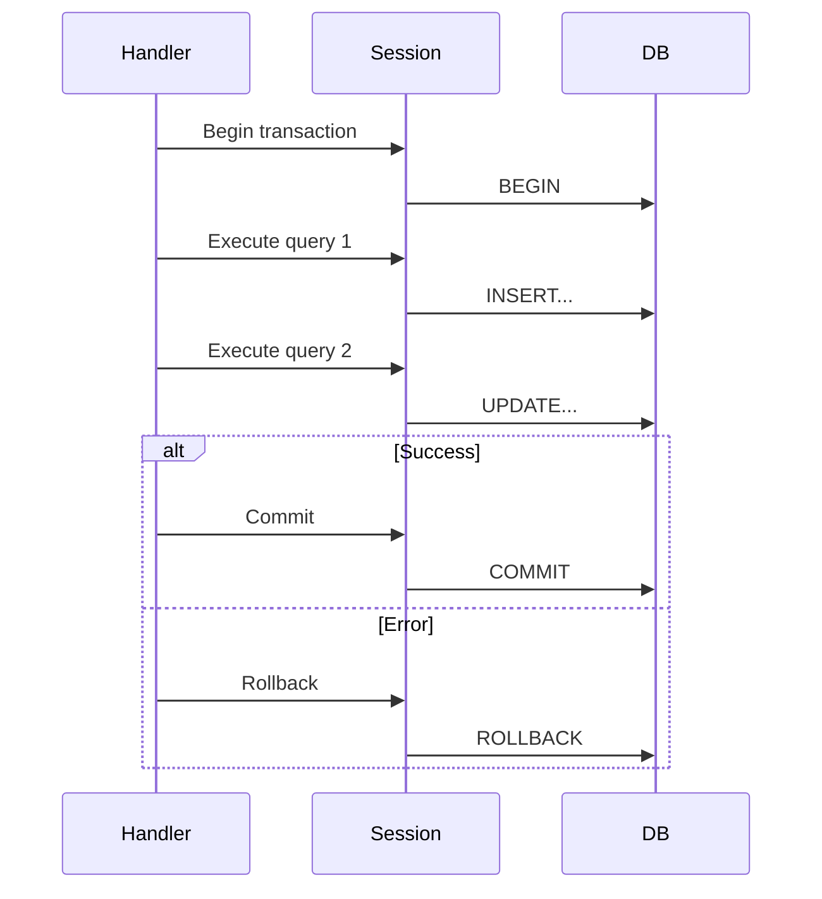

# Architecture Overview

svc-infra provides a modular architecture for building production-ready backend services. The design separates concerns into distinct layers, enabling maintainability, security, and scalability.

## System Architecture

```
┌─────────────────────────────────────────────────────────────────────┐
│                        Application Layer                            │
│  (Your business logic, domain models, service implementations)      │
├─────────────────────────────────────────────────────────────────────┤
│                          API Layer                                  │
│    FastAPI Routers  │  Middleware  │  Request/Response Models       │
├─────────────────────────────────────────────────────────────────────┤
│                        Service Layer                                │
│    Auth   │   Billing   │   Jobs   │   Webhooks   │   Config       │
├─────────────────────────────────────────────────────────────────────┤
│                      Infrastructure Layer                           │
│    Database    │    Cache    │    Queue    │    Storage            │
├─────────────────────────────────────────────────────────────────────┤
│                        Observability                                │
│      Logging      │      Metrics      │      Tracing               │
└─────────────────────────────────────────────────────────────────────┘
```

## Module Hierarchy

### API (`svc_infra.api`)

FastAPI application components:

| Component | Purpose |
|-----------|---------|
| `create_app()` | Factory for FastAPI application |
| `router` | APIRouter with common patterns |
| `middleware` | Request/response processing |
| `depends` | Dependency injection helpers |

### Auth (`svc_infra.security`)

Authentication and authorization:

- **JWT** - Token generation and validation
- **OAuth2** - OAuth2 flow handlers
- **API Keys** - Key-based authentication
- **RBAC** - Role-based access control
- **MFA** - Multi-factor authentication

### Database (`svc_infra.db`)

Database connectivity and operations:

- **AsyncDatabase** - Async PostgreSQL client
- **DbOps** - Common CRUD operations
- **Migrations** - Alembic integration
- **Connection Pool** - SQLAlchemy async pool

### Cache (`svc_infra.cache`)

Caching infrastructure:

- **Cache** - Unified cache interface
- **RedisCache** - Redis implementation
- **MemoryCache** - In-memory for testing
- **@cached** - Function decorator

### Jobs (`svc_infra.jobs`)

Background job processing:

- **JobQueue** - Task queue interface
- **Worker** - Job processor
- **Scheduler** - Cron-like scheduling

### Webhooks (`svc_infra.webhooks`)

Webhook delivery system:

- **WebhookDelivery** - Reliable delivery
- **WebhookSignature** - HMAC signing
- **WebhookRetry** - Exponential backoff

### Config (`svc_infra.config`)

Configuration management:

- **Settings** - Pydantic settings
- **Secrets** - Secret management
- **Environment** - Environment detection

---

## Request Lifecycle



---

## Authentication Flow

### JWT Token Flow



### OAuth2 Flow



---

## Webhook Delivery Flow



### Webhook Signature Verification

```python
from svc_infra.webhooks import verify_webhook_signature

# Receiving webhook
@router.post("/webhook")
async def handle_webhook(
    request: Request,
    x_signature: str = Header(...),
):
    body = await request.body()

    if not verify_webhook_signature(
        payload=body,
        signature=x_signature,
        secret=WEBHOOK_SECRET,
    ):
        raise HTTPException(401, "Invalid signature")

    # Process webhook
    data = json.loads(body)
    await process_webhook(data)
```

---

## Database Architecture

### Connection Pooling

```python
from svc_infra.db import AsyncDatabase

db = AsyncDatabase(
    url="postgresql+asyncpg://...",
    pool_size=10,
    max_overflow=20,
    pool_timeout=30,
)

async with db.session() as session:
    result = await session.execute(query)
```

### Transaction Management



---

## Caching Strategy

### Cache Layers

```
┌─────────────────────────────────────────────────────────────────────┐
│                          L1: In-Memory                              │
│              LRU Cache (per-process, <1ms latency)                  │
├─────────────────────────────────────────────────────────────────────┤
│                           L2: Redis                                 │
│            Distributed Cache (shared, ~1ms latency)                 │
├─────────────────────────────────────────────────────────────────────┤
│                          L3: Database                               │
│              PostgreSQL (persistent, ~5-50ms latency)               │
└─────────────────────────────────────────────────────────────────────┘
```

### Cache Patterns

```python
from svc_infra.cache import cached, Cache

cache = Cache(url="redis://localhost")

# Decorator pattern
@cached(ttl=300)
async def get_user(user_id: str) -> User:
    return await db.get_user(user_id)

# Manual pattern
async def get_product(product_id: str) -> Product:
    # Try cache first
    cached = await cache.get(f"product:{product_id}")
    if cached:
        return Product.model_validate(cached)

    # Fetch from DB
    product = await db.get_product(product_id)

    # Cache for next time
    await cache.set(
        f"product:{product_id}",
        product.model_dump(),
        ttl=300,
    )

    return product
```

---

## Key Design Principles

### 1. Dependency Injection

Use FastAPI's dependency system:

```python
from svc_infra import get_current_user, get_db

@router.get("/profile")
async def get_profile(
    user: User = Depends(get_current_user),
    db: AsyncDatabase = Depends(get_db),
):
    return await db.get_profile(user.id)
```

### 2. Middleware Chain

Process requests through middleware:

```python
from svc_infra.api import create_app
from svc_infra.middleware import (
    RequestIdMiddleware,
    LoggingMiddleware,
    RateLimitMiddleware,
)

app = create_app()
app.add_middleware(RateLimitMiddleware, rate="100/minute")
app.add_middleware(LoggingMiddleware)
app.add_middleware(RequestIdMiddleware)
```

### 3. Error Handling

Consistent error responses:

```python
from svc_infra.errors import NotFoundError, ValidationError

@router.get("/users/{user_id}")
async def get_user(user_id: str):
    user = await db.get_user(user_id)
    if not user:
        raise NotFoundError("User", user_id)
    return user
```

### 4. Observability

Built-in logging, metrics, and tracing:

```python
from svc_infra.observability import logger, metrics

@router.post("/orders")
async def create_order(order: OrderCreate):
    with metrics.timer("order.create"):
        logger.info("Creating order", extra={"user_id": order.user_id})
        result = await process_order(order)
        metrics.increment("orders.created")
        return result
```

---

## Integration Points

### With ai-infra

```python
from svc_infra import create_app, router
from ai_infra import Agent

app = create_app()

@router.post("/ai/chat")
async def ai_chat(request: ChatRequest):
    agent = Agent()
    response = await agent.run(request.message)
    return {"response": response}
```

### With fin-infra

```python
from svc_infra import create_app, router
from fin_infra import PlaidProvider

app = create_app()
plaid = PlaidProvider()

@router.get("/accounts")
async def get_accounts(access_token: str):
    return await plaid.get_accounts(access_token)
```

### With robo-infra

```python
from svc_infra import create_app
from robo_infra.controllers import DifferentialDrive
from robo_infra.integrations import controller_to_router

app = create_app()
rover = DifferentialDrive(...)

# Auto-generate REST API from controller
app.include_router(controller_to_router(rover))
```
